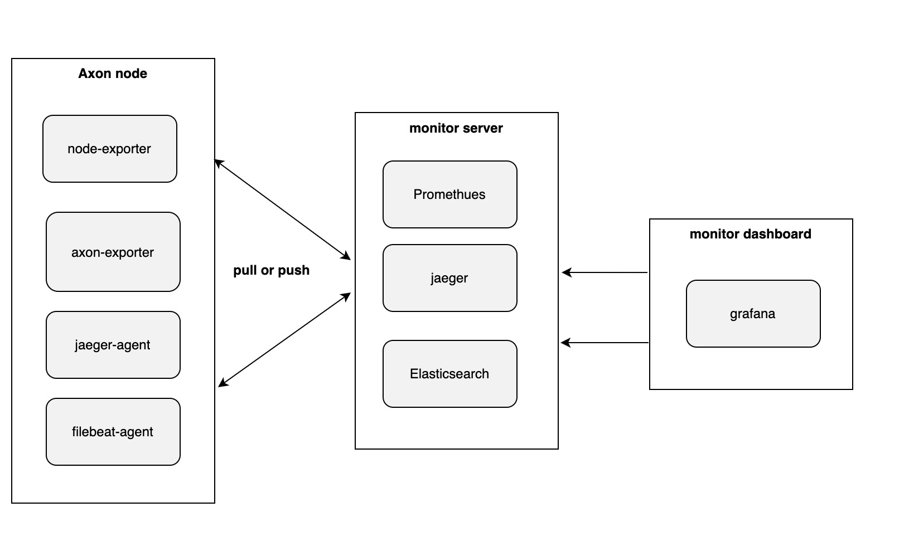

<!-- TOC -->

- [muta monitor 部署](#muta-monitor-部署)
  - [架构](#架构)
  - [工程目录结构](#工程目录结构)
  - [Agent 详解](#agent-详解)
    - [主要 agent 如下:](#主要-agent-如下)
    - [agent 目录](#agent-目录)
    - [docker-compose.yml](#docker-composeyml)
    - [.env](#env)
    - [config 目录](#config-目录)
  - [Monitor 详解](#monitor-详解)
    - [主要服务如下:](#主要服务如下)
    - [monitor 目录](#monitor-目录)
    - [docker-compose.yml](#docker-composeyml-1)
    - [config 目录](#config-目录-1)
      - [grafana](#grafana)
        - [dashboard](#dashboard)
        - [provisioning](#provisioning)
      - [loki](#loki)
        - [loki-local-config.yaml](#loki-local-configyaml)
      - [promethues](#promethues)
        - [prometheus.yml](#prometheusyml)
  - [部署步骤](#部署步骤)
    - [monitor](#monitor)
    - [agent](#agent)

<!-- /TOC -->

# muta monitor 部署

## 架构


## 工程目录结构
```
apm
|
|___ agent
|    |___ .env.example
|    |___ docker-compose.yml
|    |___ config
|          |___ promtail
|               |___ promtail-config.yaml
|
|___ monitor
     |___ docker-compose.yml
     |___ config
          |___ grafana
          |    |___ grafana.ini
          |    |___ dashboards
          |    |    |___ muta-benchmark.json
          |    |    |___ muta-node.json
          |    |
          |    |___ provisioning
          |          |___ dashboards
          |          |    |___ dashboards.yaml
          |          |
          |          |___ datasources
          |          |    |___ datasources.yaml   
          |          |
          |          |___ notifiers
          |               |___ notifiers.yaml                    
          |
          |___ loki
          |    |___ loki-local-config.yaml
          |
          |___ promethues
               |___ prometheus.yml


```

其中 agent 主要跟随 muta 部署，负责采集信息

monitor 需要一台机器部署，主要运行目前的监控服务


## Agent 详解
agent 主要跟随 muta 部署，主要用于采集 muta 的监控指标

### 主要 agent 如下:

| agent | 功能 | 参考 |
| --- | --- | --- |
| node-exporter | 采集机器信息(cpu, 内存等) | [node-exporter](https://github.com/prometheus/node_exporter) |
| jaeger-agent | tracing | [jaeger-agent](https://www.jaegertracing.io/docs/1.16/getting-started/#all-in-one) |
| promtail-agent | 采集日志 | [promtail-agent](https://grafana.com/docs/loki/latest/clients/promtail/) |

### agent 目录
```
|___ agent
     |___ .env.example
     |___ docker-compose.yml
     |___ config
           |___ promtail
                |___ promtail-config.yaml
 
```


### docker-compose.yml
muta node 采集端程序, 内部配置在 .env.example

### .env
用于配置采集端的 docker-compose 环境变量

```env
# 该配置用于给 jaeger server push 数据
# 配置为 jaeger-collector 的 ip port
# 对应 monitor docker-compose 中的 jaeger-collector 服务
JACGER_COLLECTOR_IP=jaeger-collector:14250

# 该配置用于和 muta 交互
# 配置文件地址: https://github.com/nervosnetwork/muta/blob/master/devtools/chain/config.toml
# 关联 [apm] tracing_address 参数
JACGER_AGENT_PORT=6831

# 该配置用于给 promtail 采集日志用
# 配置文件地址: https://github.com/nervosnetwork/muta/blob/master/devtools/chain/config.toml
# 关联 [logger] log_path 参数
MUTA_LOG_PATH=muta/logs
```


### config 目录
该目录主要存放 agent 的配置，目前测试环境的版本比较简单，只需要配置 promtail 的配置文件 promtail-config.yaml 即可
```yml
server:
  http_listen_port: 9080
  grpc_listen_port: 0

positions:
  # 游标记录上一次同步位置
  filename: /tmp/promtail/positions.yaml   
  # 10秒钟同步一次
  sync_period: 10s 

clients:
  # Loki 的 server 地址, port 对应 docker-compose 中暴露的端口，默认3100
  - url: http://loki-server:3100/api/prom/push

scrape_configs:
  - job_name: test-log
    entry_parser: raw
    static_configs:
      - targets:
          - localhost
        # 设置采集的 label，后续检索日志会用到，  
        labels:
          job: muta
          app: muta
          # 这里改成宿主机的 ip 方便日志查询用
          hostip: host.docker.internal
          __path__: /var/logs/*log
```

## Monitor 详解
目前 muta 测试环境使用 docker-compose 的方式部署 monitor

### 主要服务如下:

| 服务名 | 功能 | 参考 |
| --- | --- | --- |
| grafana | dashboard，监控，日志查看，告警配置 | [grafana](https://grafana.com/docs/grafana/latest/) |
| promethues | metric 存储 | [promethues](https://prometheus.io/docs/introduction/overview/) |
| loki | 日志存储 | [loki](https://grafana.com/docs/loki/latest/configuration/) |
| jaeger | tracing 存储 | [jaeger](https://github.com/jaegertracing/jaeger) |


### monitor 目录
```
|___ monitor
     |___ docker-compose.yml
     |___ config
          |___ grafana
          |    |___ grafana.ini
          |    |___ dashboards
          |    |    |___ muta-benchmark.json
          |    |    |___ muta-node.json
          |    |
          |    |___ provisioning
          |          |___ dashboards
          |          |    |___ dashboards.yaml
          |          |
          |          |___ datasources
          |          |    |___ datasources.yaml   
          |          |
          |          |___ notifiers
          |               |___ notifiers.yaml                    
          |
          |___ loki
          |    |___ loki-local-config.yaml
          |
          |___ promethues
               |___ prometheus.yml
```
### docker-compose.yml
monitor 所使用的组件, 可以直接使用

### config 目录
monitor 的 config 较多，以下按顺序描述每个目录的功能和文件内容
#### grafana
该目录主要存在两个子目录
1. dashboards 放置 dashboard 模板
2. provisioning 初始化数据源、指定初始化 dashboard 的配置文件位置、初始化告警推送配置

##### dashboard
dashboard 的配置基本是固定的并不需要修改，直接使用即可

##### provisioning
dashboards 和 datasources 目录无需修改，
notifiers 目录下的 notifiers.yaml 文件用于配置告警信息推送
```yaml
apiVersion: 1

notifiers:
  # webhook模板
  - name: notification-webhook
    type: webhook
    uid: notification-telegram
    org_id: 1
    is_default: false
    settings:
      url: http://47.56.233.149:4000/bot
```

[provisioning 配置参考](https://grafana.com/docs/grafana/latest/administration/provisioning/)


#### loki
##### loki-local-config.yaml
该文件主要为 Loki 的运行配置
```yaml
auth_enabled: false

server:
  http_listen_port: 3100

ingester:
  lifecycler:
    address: 127.0.0.1
    ring:
      kvstore:
        store: inmemory
      replication_factor: 1
    final_sleep: 0s
  chunk_idle_period: 5m
  chunk_retain_period: 30s

schema_config:
  configs:
  # 指定一个过去的日期, 该参数和存储的 index buckets 有关
  # 具体参考 https://grafana.com/docs/loki/latest/configuration/#schema_config 下的 [from: <daytime>]
  - from: 2020-05-15
    store: boltdb
    object_store: filesystem
    schema: v11
    index:
      prefix: index_
      period: 168h

storage_config:
  boltdb:
    directory: /tmp/loki/index

  filesystem:
    directory: /tmp/loki/chunks

limits_config:
  enforce_metric_name: false
  reject_old_samples: true
  reject_old_samples_max_age: 168h
  ingestion_rate_mb: 30

```


#### promethues
##### prometheus.yml
该文件主要是 promethues 的运行配置，里面 job 部分为拉取配置
```yaml
# my global config
global:
  scrape_interval:     5s # Set the scrape interval to every 15 seconds. Default is every 1 minute.
  evaluation_interval: 5s # Evaluate rules every 15 seconds. The default is every 1 minute.
  scrape_timeout:         5s
  # scrape_timeout is set to the global default (10s).

# Alertmanager configuration
alerting:
  alertmanagers:
  - static_configs:
    - targets:
      # - alertmanager:9093

# Load rules once and periodically evaluate them according to the global 'evaluation_interval'.
rule_files:
  # - "node_down.yml"
  # - "simulator_alert_rules.yml"
  # - "second_rules.yml"

# A scrape configuration containing exactly one endpoint to scrape:
# Here it's Prometheus itself.
scrape_configs:
  # The job name is added as a label `job=<job_name>` to any timeseries scraped from this config.
  - job_name: 'prometheus'
    static_configs:
    - targets: ['127.0.0.1:9090']

  # 配置为 muta-jaeger-collector 和  muta-jaeger-query 所在 ip，端口和例子如下
  - job_name: 'jaeger'
    static_configs:
    - targets: ['muta-jaeger-collector:14269','muta-jaeger-query:16687']

  # 这里配置所有 muta 节点， ['node_id_1:9100, 'node_ip_2:9100', 'node_ip_3:9100']
  # node_exporter 的默认端点就是 9100
  - job_name: 'node_exporter'
    static_configs:
    - targets: [node_exporter_ip]
  
  # 这里配置所有 muta 节点， ['node_id_1:8000', 'node_ip_2:8000', 'node_ip_3:8000']
  # 端口请查看 muta chain.toml 配置下 [graphql] listening_address 参数
  - job_name: 'muta_exporter'
    static_configs:
    - targets: ['muta_exporter_ip']


```

## 部署步骤
### monitor 
copy monitor 目录到指定机器上
```shell
$ git clone https://github.com/nervosnetwork/muta-devops
$ cd muta-devops/apm/monitor
```

按照上述 monitor 详解文档描述修改以下两个文件
- prometheus.yml
- loki-local-config.yaml

之后使用 docker 启动服务
```shell
$ docker-compose up -d 
```
使用 docker-compose 命令查看服务是否启动
```shell
$ docker-compose ps
```
所有服务都为 up 状态时, 访问浏览器查看对应监控平台

grafana
```http
http://grafana_ip:3000
```

jaeger 地址
```http
http://jarger_ip:16686
```

### agent 

copy agent 目录到 muta 节点上 
```shell
$ git clone https://github.com/nervosnetwork/muta-devops
$ cd muta-devops/apm/agent
```

修改 .env.example 为 .env, 并按照上述 agent 详解文档描述修改以下两个文件

- .env
- promtail-config.yaml


之后使用 docker 启动服务
```shell
$ docker-compose up -d 
```
使用 docker-compose 命令查看服务是否启动
```shell
$ docker-compose ps
```
所有服务都为 up 状态时, 访问浏览器可以查看对应监控指标

