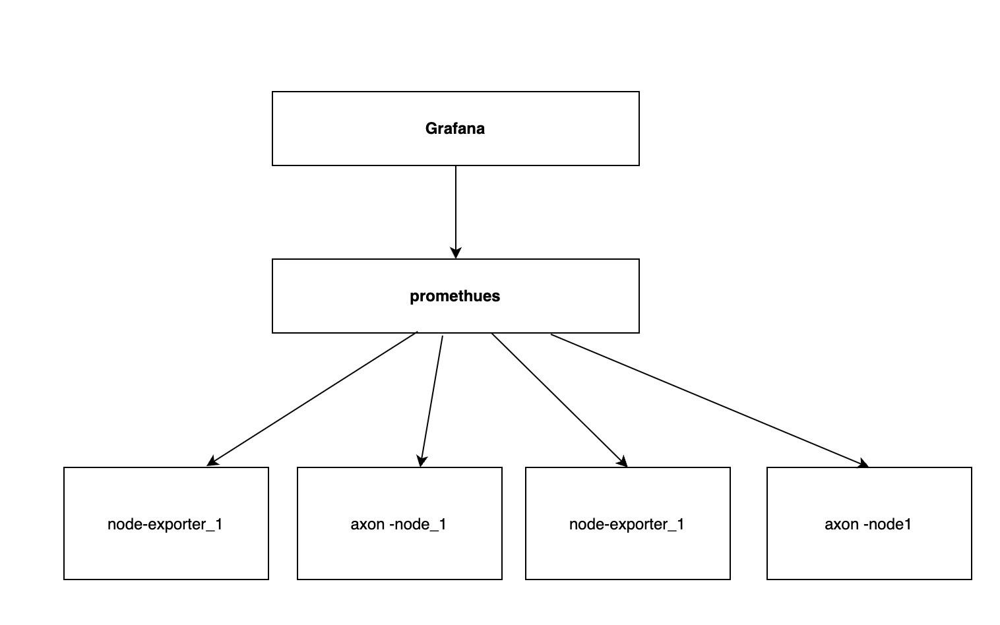
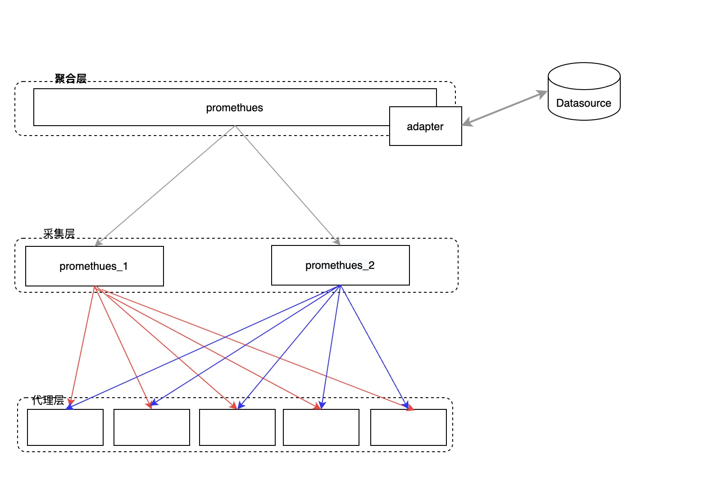
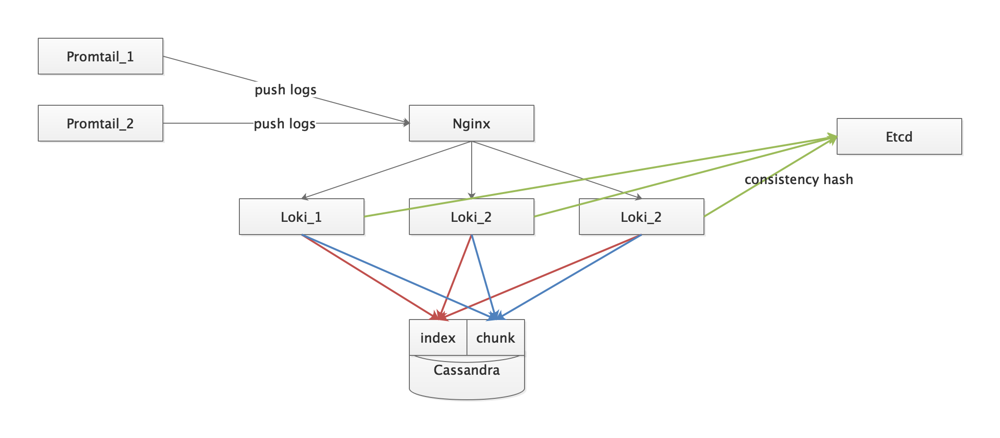
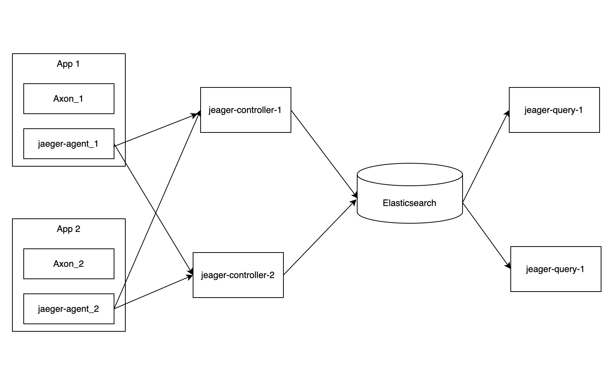

<!-- TOC -->
- [muta monitor ha 部署](#muta-monitor-ha-部署)
  - [Grafana](#grafana)
  - [Promethues](#promethues)
    - [架构分析](#架构分析)
    - [生产部署建议](#生产部署建议)
      - [组件列表](#组件列表)
      - [逻辑结构](#逻辑结构)
  - [Loki](#loki)
    - [架构分析](#架构分析-1)
    - [生产部署建议](#生产部署建议-1)
      - [组件列表](#组件列表-1)
      - [逻辑结构](#逻辑结构-1)
  - [Jaeger](#jaeger)
    - [架构分析](#架构分析-2)
    - [生产部署建议](#生产部署建议-2)
    - [组件列表](#组件列表-2)
    - [逻辑结构](#逻辑结构-2)

# muta monitor ha 部署
该文档用于说明 muta monitor 组件的高可用部署方式
- Grafana
- Promethues
- Loki
- jaeger

## Grafana
[官文推荐的高可用部署方式](https://grafana.com/docs/grafana/latest/tutorials/ha_setup/)

## Promethues

### 架构分析
下图是一个简易的 Promethues 部署结构图

这种部署方式主要面临了以下几个问题:
- 单点问题: 节点意外 down 后，无法继续提供服务
- 数据存储问题: 数据存储在本地磁盘，无法对节点进行拓展

Promethues 官方提供了以下两种机制，可以解决单点和数据存储问题
- [联邦集群](https://prometheus.io/docs/prometheus/latest/federation/)
- [远程存储](https://prometheus.io/docs/prometheus/latest/storage/)

### 生产部署建议
使用官方提供的的联邦集群来做节点高可用，使用远程存储，统一存储数据

数据的保留时间可以根据存储的选择定期清理，以 InfluxDB 为例子，可以参考 [官方配置](https://docs.influxdata.com/influxdb/v1.8/administration/config/#configuration-overview)

#### 组件列表
| 组件名 | 参考链接 | 说明 |
| --- | --- | --- |
| influxdb | [influxdb home](https://docs.influxdata.com/influxdb/v1.8/administration/config/) | 存储的组件，可根据官方文档替换 | 
| prometheus | [prometheus home](https://prometheus.io/docs/prometheus/latest/federation/ ) | - |
| remote-storage-adapter | [remote-storage-adapter git](https://github.com/prometheus/prometheus/blob/master/documentation/examples/remote_storage/remote_storage_adapter/README.md) | 处理 remote storage 的组件 |

#### 逻辑结构

## Loki
### 架构分析
Loki 架构

Loki 的架构中比较重要的部分:
- Distributor: Distributor 会对 Promtail 发送的日志流进行正确性校验，并将验证后根据 Hash 和元数据算法计算应该路由到那个 Ingester 上
- Ingester: Ingester 接收来自 Distributor 的日志流，并将日志压缩后存放到所连接的存储后端。 写入主要分为两个部分
  - 写入IndexStore
  - 写入ChunkStore
- Querier: 查询聚合数据，大致逻辑就是根据chunk index中的索引信息, 请求 ingester 和对象存储. 合并后返回

### 生产部署建议
Loki 使用一致性哈希来保证数据流和 Ingester 的一致性，他们共同在一个哈希环上，哈希环的信息可以存放到Etcd、Consul或者内存中 当使用 Etcd 或 Consul 作为哈希环的实现时，所有 Ingester 通过一组 Token 注册到环中，每个 Token 是一个随机的 32-bit 无符号整数，同时 Ingester 会上报其状态到哈希环中。由于所有的 Distributor 使用相同的 Hash 环，写请求可以发送至任意节点

在Loki 中，Ring用于 Ingester 和 Distributor 的服务注册和发现， Ring 的实现使用了键值存储

**生产环境由于要起多个 Distributor 节点做高可用, Hash Ring 建议存储到外部的 Consul 或 Etcd 集群中**

**由于默认情况下 Loki 的 IndexStore 和 ChunkStore 存储于节点的磁盘上，建议使用第三方存储统一存储数据**

关于日志的保留时间，按需求参考官方配置 [table_manager_config](https://grafana.com/docs/loki/latest/configuration/#table_manager_config) 部分

#### 组件列表
| 组件名 | 参考链接 | 说明 |
| --- | --- | --- |
| loki | - | - |
| etcd | [官方一致性哈希配置](https://grafana.com/docs/loki/latest/configuration/) | 存储一致性哈希，可根据官方文档替换 |
| cassandra | [官方持久化配置参考](https://grafana.com/docs/loki/latest/storage/) | 可根据官方文档替换 |
| nginx | - | 用于处理集群后的请求分发 |
| promtail | - | log 采集，可根据官方文档替换，跟随应用部署 |

#### 逻辑结构

## Jaeger
### 架构分析
Jaeger 架构

Jaeger 主要由组件:
- jaeger-agent: 接收 jaeger-client 的数据，并上报给 jaeger-collector
- jaeger-collector: 处理 jaeger-agent 上报的数据，做持久化操作
- jaeger-query: 处理查询相关的逻辑      
- jaeger-ingester: 如果采集的数据量较大，可以引入 Kafka 作为缓冲，jaeger-ingester 用于处理和 Kafka 的交互

### 生产部署建议
Jaeger 各组件之间可以独立存在，通过 RPC 通信，所以生产环境建议部署多个 jaeger-collector 做采集节点的高可用

jaeger-query 建议也部署多个节点，并在前面增加个 nginx 做查询的高可用

数据的保留时间可以根据存储的选择定期清理，以 ElasticSearch 为例子，可以参考 [官方 delete Api](https://www.elastic.co/guide/en/elasticsearch/reference/5.6/docs-delete-by-query.html)
或 [官方的 Curator 项目](https://github.com/elastic/curator)

### 组件列表
| 组件名 | 参考链接 | 说明 |
| --- | --- | --- |
| elasticsearch | [elasticsearch docs](https://www.elastic.co/guide/en/elasticsearch/reference/current/index.html) | 用于存储数据，可根据官方文档替换 |
| jaeger-collector | [官方配置文档](https://www.jaegertracing.io/docs/1.18/cli/) | 用于接收 agent push 的数据 |
| jaeger-query | 同上 | 用于查询数据 |
| jaeger-agent | 同上 | 用于与 client 交互，跟随应用部署 |

### 逻辑结构

