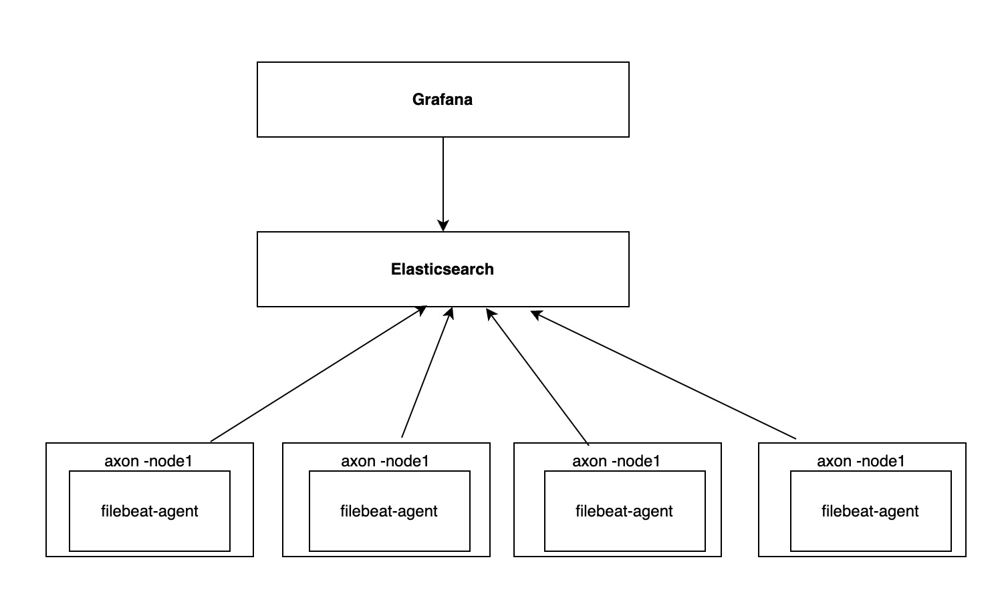
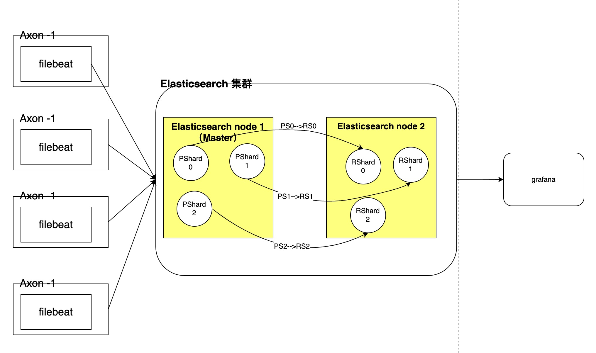

<!-- TOC -->
- [axon monitor ha 部署](#axon-monitor-ha-部署)
  - [Grafana](#grafana)
  - [Promethues](#promethues)
    - [架构分析](#架构分析)
    - [生产部署建议](#生产部署建议)
      - [组件列表](#组件列表)
      - [逻辑结构](#逻辑结构)
  - [elasticsearch](#elasticsearch)
    - [架构分析](#架构分析-1)
    - [生产部署建议](#生产部署建议-1)
      - [组件列表](#组件列表-1)
      - [逻辑结构](#逻辑结构-1)
  - [Jaeger](#jaeger)
    - [架构分析](#架构分析-2)
    - [生产部署建议](#生产部署建议-2)
    - [组件列表](#组件列表-2)
    - [逻辑结构](#逻辑结构-2)

# axon monitor ha 部署
该文档用于说明 axon monitor 组件的高可用部署方式
- Grafana
- Promethues
- Elasticsearch
- jaeger

## Grafana
[官文推荐的高可用部署方式](https://grafana.com/docs/grafana/latest/tutorials/ha_setup/)

## Promethues

### 架构分析
下图是一个简易的 Promethues 部署结构图

这种部署方式主要面临了以下几个问题:
- 单点问题: 节点意外 down 后，无法继续提供服务
- 数据存储问题: 数据存储在本地磁盘，无法对节点进行拓展

Promethues 官方提供了以下两种机制，可以解决单点和数据存储问题
- [联邦集群](https://prometheus.io/docs/prometheus/latest/federation/)
- [远程存储](https://prometheus.io/docs/prometheus/latest/storage/)

### 生产部署建议
使用官方提供的的联邦集群来做节点高可用，使用远程存储，统一存储数据

数据的保留时间可以根据存储的选择定期清理，以 InfluxDB 为例子，可以参考 [官方配置](https://docs.influxdata.com/influxdb/v1.8/administration/config/#configuration-overview)

#### 组件列表
| 组件名 | 参考链接 | 说明 |
| --- | --- | --- |
| influxdb | [influxdb home](https://docs.influxdata.com/influxdb/v1.8/administration/config/) | 存储的组件，可根据官方文档替换 | 
| prometheus | [prometheus home](https://prometheus.io/docs/prometheus/latest/federation/ ) | - |
| remote-storage-adapter | [remote-storage-adapter git](https://github.com/prometheus/prometheus/blob/master/documentation/examples/remote_storage/remote_storage_adapter/README.md) | 处理 remote storage 的组件 |

#### 逻辑结构

## elasticsearch

### 架构分析-1
下图是一个简易的 elasticsearch 部署结构图

目前elasticsearch是单节点部署（discovery.type=single-node）,这种部署方式主要面临了以下问题:
- 单点问题: 节点意外 down 后，无法继续提供服务

Elasticsearch 可以多节点 Elasticsearch 集群，以解决单点问题
- [多节点 Elasticsearch 集群](https://www.elastic.co/guide/en/elasticsearch/reference/8.1/next-getting-started-tls-docker.html)

### 生产部署建议-1
es是很吃内存，不是jvm的内存，而是机器的内存。es底层基于lucene，Elasticsearch 和 Lucene 都是 Java 语言编写，这意味着我们必须注意堆内存的设置。

关于日志的保留时间，按需求参考官方配置 [index-lifecycle-management](https://www.elastic.co/guide/en/elasticsearch/reference/7.5/index-lifecycle-management.html#index-lifecycle-management) 部分

#### 组件列表-1
| 组件名 | 参考链接 | 说明 |
| --- | --- | --- |
| elasticsearch | [elasticsearch docs](https://www.elastic.co/guide/en/elasticsearch/reference/current/index.html)| elasticsearch官方部署文档 |
| filebeat |[filebeat docs](https://www.elastic.co/guide/en/beats/filebeat/current/filebeat-overview.html) | 节点log 采集并forword 给elasticsearch，可根据elasticsearch官方文档替换

### 逻辑结构-1

## Jaeger
### 架构分析-2
Jaeger 架构

Jaeger 主要由组件:
- jaeger-agent: 接收 jaeger-client 的数据，并上报给 jaeger-collector
- jaeger-collector: 处理 jaeger-agent 上报的数据，做持久化操作
- jaeger-query: 处理查询相关的逻辑      
- jaeger-ingester: 如果采集的数据量较大，可以引入 Kafka 作为缓冲，jaeger-ingester 用于处理和 Kafka 的交互

### 生产部署建议-2
Jaeger 各组件之间可以独立存在，通过 RPC 通信，所以生产环境建议部署多个 jaeger-collector 做采集节点的高可用

jaeger-query 建议也部署多个节点，并在前面增加个 nginx 做查询的高可用

数据的保留时间可以根据存储的选择定期清理，以 ElasticSearch 为例子，可以参考 [官方 delete Api](https://www.elastic.co/guide/en/elasticsearch/reference/5.6/docs-delete-by-query.html)
或 [官方的 Curator 项目](https://github.com/elastic/curator)

### 组件列表-2
| 组件名 | 参考链接 | 说明 |
| --- | --- | --- |
| elasticsearch | [elasticsearch docs](https://www.elastic.co/guide/en/elasticsearch/reference/current/index.html) | 用于存储数据，可根据官方文档替换 |
| jaeger-collector | [官方配置文档](https://www.jaegertracing.io/docs/1.18/cli/) | 用于接收 agent push 的数据 |
| jaeger-query | 同上 | 用于查询数据 |
| jaeger-agent | 同上 | 用于与 client 交互，跟随应用部署 |

### 逻辑结构-2

