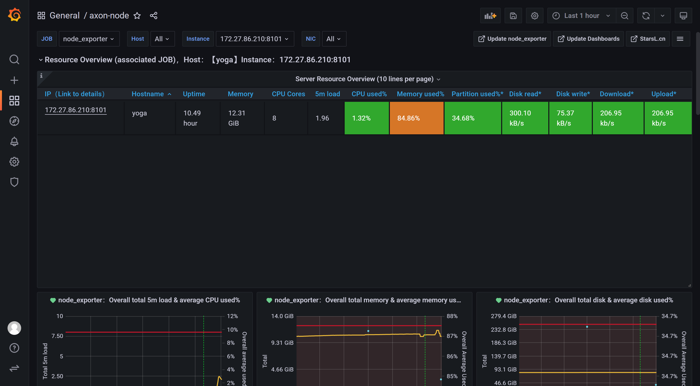
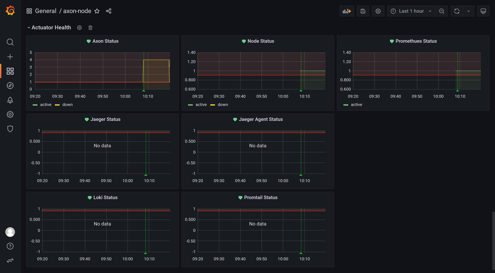
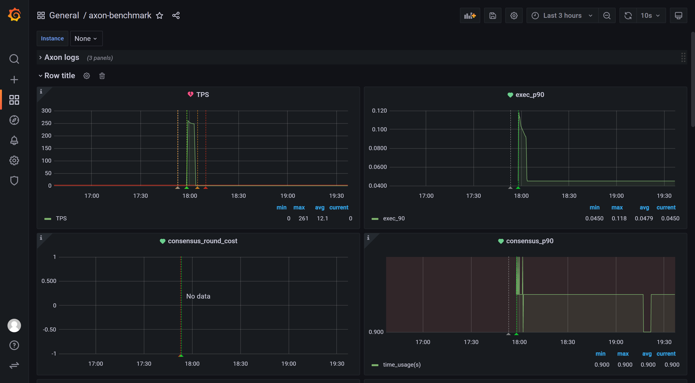

# Axon CLI
You need to take the following steps to run axon and benchmark with axon-cli.
## 1. Build axon-cli
Under the axon-cli directory, run the following command:
    `cargon build --release`
## 2. Run axon-cli
 For example,
`
../target/debug/axon-cli`

## 3. Interactive Commands
After axon-cli gets run. You have 5 commands to execute.
By the way, before to start docker containers, you have to enable tcp port for docker(0.0.0.0:2375 in this case).
- start  
you can start 1 or 4 docker axon nodes. The default is 1, you can start 4 by `axon start --number=4`.
you can specify the axon dir by adding things like `-d=/root/test`. 
- stop  
stop the 4 docker nodes just started.
- rm  
remove the 4 docker containers just created.
- del  
delete chain data under the path specified by parameter --data-dir. If not specified, it will be the dir specified by `axon start -d` plus `devtools/chain`.
- bm  
start benchmark, transactions will be sent to the axon nodes. You must specify benchmark dir by --data-dir like `axon bm --data-dir=/home/wenyuan/git/axon-devops/benchmark/benchmark`.  

## 4. Check axon status  
To be sure of the correctness. You can check by the following commands:  
### 1．check the liveness of axon nodes 
>root@yoga:# docker ps  
CONTAINER ID   IMAGE     COMMAND                  CREATED          STATUS          PORTS     NAMES  
d82bf78d05cc   axon:v1   "./axon -c=/app/devt…"   41 seconds ago   Up 38 seconds             axon1  
3cdd6cab7077   axon:v1   "./axon -c=/app/devt…"   41 seconds ago   Up 38 seconds             axon3  
303bd01e6bd6   axon:v1   "./axon -c=/app/devt…"   41 seconds ago   Up 37 seconds             axon2  
e54ad14dbb24   axon:v1   "./axon -c=/app/devt…"   41 seconds ago   Up 37 seconds             axon4

### 2．check the axon logs
>root@yoga:~# docker logs axon4 | grep height  
[2022-04-12T00:58:52.340656848+00:00 INFO core_network::outbound::gossip] no trace id found for gossip /gossip/consensus/broadcast_height  
[2022-04-12T00:58:52.341000035+00:00 INFO overlord::state::process] overlord: start from wal wal info height 472, round 1, step Propose  
[2022-04-12T00:58:52.341056842+00:00 INFO overlord::state::process] Overlord: "027ffd6a6a231561f2afe5878b1c743323b34263d16787130b1815fe35649b0bf5" become leader, height 472, round 1  
[2022-04-12T00:58:54.342405157+00:00 INFO core_network::outbound::gossip] no trace id found for gossip /gossip/consensus/broadcast_height  

It's easy to find the chain height has grown to height 472, and if you check it later, you can find the height is larger than the current 472.

### 3．check the network connect between the nodes.
```
    docker exec -it axon1 /bin/bash
    apt install net-tools
    apt install iputils-ping
```
`ping axon2` without timeout like following:
>root@6f816d8be4b7:/app# ping axon2  
PING axon2 (172.18.0.2) 56(84) bytes of data.  
64 bytes from axon2.axon-cli_axon-net (172.18.0.2): icmp_seq=1 ttl=64 time=0.298 ms  
64 bytes from axon2.axon-cli_axon-net (172.18.0.2): icmp_seq=2 ttl=64 time=0.074 ms  

or 
>netstat -tnp | grep axon show 3 other nodes like following:  
root@6f816d8be4b7:/app# netstat -tnp | grep axon  
tcp        0      0 172.18.0.3:8001         172.18.0.2:8001         ESTABLISHED 1/./axon   
tcp        0      0 172.18.0.3:8001         172.18.0.5:8001         ESTABLISHED 1/./axon  
tcp        0      0 172.18.0.3:8001         172.18.0.4:8001         ESTABLISHED 1/./axon

## 5. Start Benchmark
`bm` is short for benchmark, this command will start benchmark. You can run `docker logs bm` to have a look at the benchmark status.
For example:  
>root@yoga:~# docker logs bm  
/////////////////////////////////////////////////////  
benchmark time: 60000 ms  
endpoint: http://172.17.0.1:8000  
/////////////////////////////////////////////////////  
>  
>waiting...  
preparing...  
>  
>deploying contract:  ERC20  
contract ERC20 deployed to 0xF67Bc4E50d1df92b0E4C61794A4517AF6a995CB2  
>  
>prepared  
benchmark case 0: ./benchmark  
>  
>/////////////////////////////////////////////////////  
benchmark time:  64650.558417998254 ms  
transaction count: 7200  
TPS: 111.3679475658724 ms  
transfer rate: 98.83  
/////////////////////////////////////////////////////  

You can check the result by the end of the output.

## 6. start apm
We offer `apm start` and `apm stop` commands to start and stop apm features respectively.
However, before you start, you need to get some configs prepared.
- In `axon-cli/apm/deploy/hosts`, change ip of axon_node to your own ip. In my case, it is `172.19.86.210`.

- In `apm/deploy/roles/monitor/vars/main.yaml`, change `monitor_dir` to your dir.  
All monitor related files willed be moved here, the data will be stored under `monitor_dir/data`.

- In `apm/deploy/roles/agent/vars/main.yaml`.  
First, set `monitor_agent_dir` to your dir. All agent related files willed be moved here, the data will be stored under `monitor_agent_dir/data`.
Second, set `log_path`.  
At present, there is no need to modify `monitor_address` and `es_address`. 

- The correct execution of `apm start` now depends on the apm path. You need commands like this:  
   `apm start -p=/home/wenyuan/git/axon-devops/axon-cli/apm` or 
   `apm stop` 

- To clean data, you need command `clean` like this:  
   `apm clean -p=/home/wenyuan/git/axon-devops/axon-cli/apm`.

Remeber, `apm start` may take a long time to complete due to heavy underground jobs, please be patient.  
After the right config and the successful start of apm, you can visit Grafana by localhost:8600 in your browser.
You can take a look at the `axon-node` Dashboard.
<div align=center></div>
<div align=center></div>

If you just run the benchmark, you can have a look at the `axon-benchmark` Dashboard.
<div align=center></div>

# 7. CKB -> AXON tx
## 1. deploy crosschain metadata
`cs --sender-key=dd50cac37ec6dd12539a968c1a2cbedda75bd8724f7bcad486548eaabb87fc8b --capacity=1000 --tx-type=0`

## 2. transfer token from CKB to AXON
`cs --sender-key=dd50cac37ec6dd12539a968c1a2cbedda75bd8724f7bcad486548eaabb87fc8b --capacity=1000 --tx-type=1`

